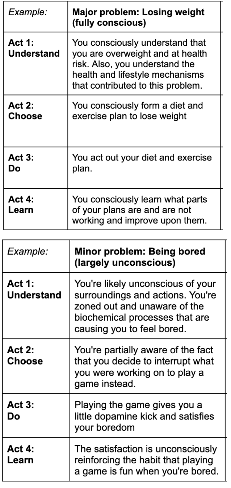

> The 4 Acts book is currently in review! If you'd like to proofread a copy, please e-mail me at book@edwindoit.com

*The following passage is the introduction to The 4 Acts:*

# **Introduction** 

Our lives are incredibly dynamic. To navigate the world, the average adult makes just under 35,000 decisions per day. We decide what to wear, which route to take, whom to call and what order to do all these things in.  When we take away 8 hours of sleep, this gives us an average of one decision every 2 seconds. Luckily, our bodies are decision-making machines and take care of most of these decisions automatically. Even when decisions are only partially conscious, we have an abundance of helpful mental shortcuts that help us decide what to do. This allows us to move effortlessly through life, without having to focus on every single detail. Nevertheless, these mechanisms are not what makes humans special. It's not what allows us to fly to the moon or sequence DNA.

These results come from our unique ability to *understand* what's happening. Because of this awareness, we can intentionally change our behavior. We can analyze what we’re doing, how well we’re doing, and why we're even doing it. 

This ability to self-assess, error-correct and learn is the greatest advantage humans possess, and putting it to use is naturally hardwired into us. It's why we will read non-fiction like this book. We are naturally curious and driven to learn more about the word and ourselves. Whether it’s a new skill we’d like to acquire, a gap in our knowledge to fill or an intellectual curiosity to satisfy, we use the act of understanding. The first step towards understanding is finding the resources that we can learn from.  

In today’s world, we’re fortunate that there is an abundance of knowledge available to us. We have the internet at our fingertips and within an ever-expanding library of tutorials, videos, books and courses. But along with this vast amount of knowledge emerges a challenge: the ability to find the *right* knowledge. With more knowledge available, the quality gap widens. Our job is not to simply seek out any knowledge. We must hone in on the right knowledge and disregard the junk.

Finding the specific sources you need and assessing the quality of that knowledge can be extremely difficult and time-consuming. To avoid this, we’ll often default to (subconscious) indicators of credibility. This mental shortcut causes us to reach for a popular book endorsed by our favorite celebrity or join a class on the recommendation of a friend. We don't engage our own critical thinking and trust that those external factors point to the right sources. In this way, we treat our knowledge growth like building a toolbox, collecting facts, anecdotes, hacks, and principles that, we assume, will be useful. We skim past the underlying reasoning and look for knowledge that we can quickly put to use. 

I define this type of knowledge as Factual Knowledge; information founded on trusted utility without a required explanation. As our toolkit of factual knowledge grows, we trust it will make us more effective, but we don’t stop to consider if that's really the case.

This has several disadvantages. Most notably, we put the solution (toolkit) first, and skip asking what the exact problem is we're trying to solve. We're so excited to use our tool that we forget to check if it's right for the job. That's where the infamous saying “To a man with a hammer, everything looks like a nail” comes from. Secondly, factual knowledge lacks the finer details of which cases it is and isn't useful. We can see both play out in the following example: Jake is often tired and wants to increase his energy levels. He reaches into his toolbox and quickly finds a plant-based diet recommended by his favorite athlete. Unfortunately, his situation worsens as it turns out that in his case the exact cause underlying his energy-problem was an iron and vitamin B deficiency.

Jake's approach skips a fundamental step of checking whether the new knowledge is relevant to his specific problem. He forgot to define the root-problem and therefore lacks a criterion for an appropriate solution. He's trying to use a predefined set of tools to solve a unique and nuanced problem. At its extreme, this is like throwing darts blindfolded and hoping you hit a bullseye. 

To optimally explore a problem and find the most appropriate solution, we need to first **understand** the problem and its context. Once understood, we can evaluate the range of solutions that are available. We can compare them, prioritize them and ultimately, we **choose** the knowledge we'd like to obtain or the action we'd like to take. With our new knowledge, we can then begin to solve our problem by **doing** the work in the most effective manner. Once the problem is solved, we can regroup and update our knowledge, which we call **learning**. We can reflect on the outcome of our actions, gain insights from the experience, and use this knowledge to improve our future iterations of this cycle.

Through my own research and exploration, I've found that breaking down actions into these four distinct categories \- **Understanding, Choosing, Doing** & **Learning** \- provides clarity. I call this cycle The 4 Acts. The 4 Acts operate as a repeatable cycle. All human behavior falls into one of these 4 main acts.

By building our awareness of this cycle, we can begin to understand both ourselves and other people at a deeper level. We can also use the steps of the cycle to actively choose the most effective knowledge to learn and apply, before enacting the solution that is best suited. In short: With the 4 Acts, we can identify the optimal course of action for any given situation.

Unlike building a toolbox of factual knowledge, I aim to promote a better way to build knowledge: beginning with explanations. By repeating and internalizing the 4 Acts cycle, we develop and construct an explanatory view of how the world works. This results in a richer, more accurate model of reality as it is based on a foundation of explanations, rather than a collection of trusted facts. This explanatory foundation increases the depth, accuracy and range of our knowledge. But most importantly, it allows us to reliably improve our knowledge and effectiveness. 

# **The 4 Act Cycle**

We begin the cycle with Act 1 understanding. There we learn how to understand a problem by seeking the root-cause and understanding the environment in which the problem exists. We explore the 4 layers that make up any environment, from universal physics to our own human experience and psychology.

In Act 2, Choosing, we walk through the 3 steps of decision-making and how to apply this method to both macro and micro problems. By completing the steps within this act, we end up with a clear goal and plan of what we aim to do to solve our problem. All that's left is to execute it.

In Act 3 Doing, we explore the 4 ways to optimally execute our intentions, as opposed to other distractions. Each method gives us a different approach to optimize our willpower.

Finally, in Act 4 Learning, we cover the 4 steps to effective learning. By following these 4 steps, we can ensure we are updating our worldview in the most effective way and deepening our understanding along the way. We avoid future mistakes, and improve our situational awareness.

With these 4 Acts, you can learn a simple, repeatable process which you can use to assess any real-world situation. You'll be able to easily distinguish the critical steps in any process, providing you with the information to better understand it. By breaking down each problem into logical chunks and sub-steps, which individually can be **examined logically,** as opposed to following your intuitive perception, you'll be able to determine the **optimal** course of action for each given situation. In this book, I define "logical" in a way that also considers our seemingly irrational psychological tendencies and their evolutionary roots.

I designed the "The 4 Acts" to be a comprehensive and universal model. Every type of action, knowledge and resources can naturally find their place. Rather than being just another framework, "The 4 Acts" serves as a meta-framework in which you can incorporate and integrate other processes.

As an example, let’s take the popular SMART (Specific, Measurable, Actionable, Relevant, Time-Bound) framework. This is a specific framework that we may want to use to help us set actionable goals. This sits within Act 2: Choosing. We can use the SMART framework as an effective method to accurately define our desired outcome. Each time we progress through a cycle of the 4 acts, we can use the SMART framework to assist us within Act 2\.

Not just individual actions like goal-setting, but also entire frameworks, models and processes map to the 4 Acts. That's not because it was designed brilliantly, but rather that many others also converged on the same learning-cycling as a practical model for human action. It's therefore a familiar pattern that you'll regularly come across. Some examples are: The Observe Orient Decide Act loop of decision-making, The Listen Clarify Debate Decide cycle of management decisions, The Build Measure Learn loop used in product-development and the Design Thinking approach to problem-solving. 

# **How To Use The 4 Acts**

Every action we take falls into part of The 4-Act Cycle: Understand, Choose, Do, Learn. We can recognize what specific act and sub-act we're dealing with, and then choose to intervene accordingly.

Note that the 4 Acts model isn't intended to be painstakingly applied to each little problem you face—we simply don't have the time or energy for that. In most cases, we will focus on just one step without realizing we're in a 4 Act cycle. However, there are times when it's worth carefully considering each step in detail, such as when you're deciding on a major career move, making a significant investment for your company, or mastering a new skill. 

To illustrate how you can tailor the amount of effort to the severity of the problem, we'll run through some scenarios. 

By default, we pass through the acts on autopilot: unconsciously and without intention. When working through a backlog of emails, we’ll find that the majority of our responses don’t require a deep level of thought. We’ll start working on full autopilot and just go on with our actions with little regard for optimal action or mistakes. We trust our intuition and allow our unconscious to make our decisions.

Other times we'll concentrate on a specific act and disregard the others. We might come across a tricky email that needs specific financial insight. We’ll snap ourselves out of autopilot and begin focusing on understanding if the right calculations have been used. In this case, we’re optimizing Act 1: Understanding. Once we understand the information as correct, we can simply proceed as per our usual autopilot. Although, you don't necessarily need to start with Act 1\. For instance, when we're getting tired at the end of a run, we may focus all our energy on just doing it (Act 3\) and disregard all other thoughts.

We may also find that some situations require us to assess multiple acts at once. We might need to send a very candid email to reply to a recent job offer. In this example, we’ll need to consciously understand the offer, evaluate the ways in which we could respond to it, and ultimately choose the right solution to communicate. Therein we focus on optimizing 3 of the acts; Understanding, Choosing and Doing.

Now and then, we might decide to control each act in the cycle. This full-breath of conscious action may be needed when we are deep into a critical and complex email chain about a legal-case. It's not enough to optimize the 3 acts of Understanding, Choosing and Doing, you also will need to continually learn and update your understanding. Each sentence that is exchanged has to be acknowledged and incorporated into a coherent narrative. This is the full cycle of the 4 acts in action. 

## **Examples of using The 4 Acts**

Here are some examples of how the 4 Acts are applied in practice:

# **The benefits of using The 4 Acts Cycle** 

With the 4 Acts, you can identify the optimal course of action for any given situation. You're able to easily distinguish the steps in any process, providing you with the insight to better understand it. By breaking down each problem into logical sub-steps, they can be individually can analyze rationally, as opposed to following your intuition. 

That being said, the ultimate value of using the 4 Acts framework is reached when you don't just apply the model, but understand, internalize and develop your own explanatory worldview. This point is by far the most powerful; therefore, let’s explore the 3 reasons why holding and developing your own explanatory worldview is so useful:

1. **You can apply first principle thinking** to effectively solve problems from a base-level understanding of how everything works, as opposed to starting from scratch.  
2. **You can filter out nonsense quicker** by knowing how the world works, and more importantly, how it doesn't. Ignore the nonsense.  
3. **You can construct and readjust your worldview** when you go through experiences and acquire new knowledge.

To illustrate these benefits, I'd like to walk you through an example of how all three helped me throughout various challenges in my career.

## **1\. Applying first-principle thinking**

When I first transitioned from a design role to a management role, one of the first new responsibilities I had was to hire new employees. Typically, this went fine, however in one instance I was surprised by how bad it worked out with a hire. It was a mess. I had mistaken his energy, sharpness and quick-wit for actual competence. It quickly became clear he was only concerned with upholding the appearance of being on top of things, rather than delivering work, asking clarifying questions or getting the ball rolling in any way. After a few weeks without tangible output or improvement, I decided we should part ways. Thereafter, I used first principle thinking to reflect upon my mistakes in the hiring process. I found that my errors likely stemmed from mental shortcuts used in decision-making. Communicating with the candidate went so smoothly, it made me overlook warning signs and skip critical questions. Also, I had a winning streak in another domain at work, which made me foolishly overconfident at the time. My explanatory worldview and first-principle thinking made me aware that the shortcuts that caused me to make these errors evolved to make deciding quicker and easier. Unfortunately, they do so at the cost of accuracy and consistency. Both of these mistakes are valuable lessons that I try to be mindful of whenever I'm in an interview now. 

## **2\. Filtering out nonsense** 

Not much later, I was asked by our CEO to create detailed plans and forecasts of what new releases we would deliver for each product-line in 3,6,12 and even 24 months time. Instead of diving into it and investing days into highly detailed forecasts, I figured that this would be in vain. That's because my explanatory worldview tells me that this request contradicts how the world works. It was nonsensical. Firstly, there's too much uncertainty to ensure accurate predictions. This is because internal and external variables are too many and intertwined to compute and predict accurately beyond around 3 months into the future. And secondly, It'd also mean I'd have to factor in the actions of other people and companies, which aren't just unpredictable; they are unknowable. So, instead, I went back to the CEO and negotiated that we can tailor the accuracy of the planning towards the timeframe. 3 months will be detailed, 6 months rough, 12 months will be financial targets without much of a plan and 24 months purely speculative. He agreed, and we maintain a similar strategy to this day.

## **3\. Constructing and readjusting your worldview**

A lot of eager-beavers may recognize that it's easy to become very busy very fast. I didn't think this would be much of an issue for me, as I already had a pretty solid understanding of time-management and productivity from doing my own research. I knew to list and prioritize the important activities and to schedule it so it gets done. This ensured I had enough time for all the essentials like, work, relaxation, gym, sleep, leisure and healthy eating. But it still felt like I was always catching up and losing energy. This warranted me to look for an improvement to my worldview on scheduling.  I found what I was looking for in the book "The Productivity Project by Chris Bailey". That helped me realize that I also should allocate time for non-urgent "maintenance" work. Every Saturday I now spend 3–4 hours cleaning, washing, making back-ups, organizing mail, updating my finances and those kinds of small things. This brings me peace of mind as well as a great sense of accomplishment. Because I originally had an explicit understanding of all the components involved in organizing my time and energy, I was able to easily identify a gap and update it. If I was just following someone else's time-management structure blindly, and it didn't work, I might be inclined to trash the whole thing and look for the next shiny tool for my toolkit. 

Holding an explanatory worldview has helped me tremendously in my pursuit to be more effective and happy, and I believe it can do the same for you. Throughout this book, the *explanation* chapters describe the theory of how things work. You can identify each explanation chapter by the lightbulb icon: 💡.  
*Application* chapters describe how to apply the knowledge of the explanation chapters in practice. Many of the application chapters also feature worksheets available on my website. You can identify the application chapters by the 🛠️ icon. 

Each act starts with an introduction and ends with a summary. In addition, the individual chapters also all have summaries. The 4 Acts book can be comfortably read from start to finish, but each chapter also stands alone. 
*This is the end of the introduction to 4 Acts. The chapters are:*

**ACT I: Understanding**
  💡 1. How understanding works 
  🛠️ 2. Finding the root-problem
  🛠️ 3. Analyzing the environment of the problem (through systems)
  💡 4. Understanding the world as systems
  💡 5. Understanding life's systems
  💡 6. Understanding human systems
  🛠️ 7. Understanding yourself (coming soon)
  💡 8. Understanding the physical world
  💡 9. Understanding the limits of reality
  **ACT II: Choosing**
  💡 10. How humans choose what to do
  🛠️ 11. Specifying the intended outcome   (Goal-setting)
  🛠️ 12. Generating potential solutions to reach the goal
  🛠️ 13. Micro decision-making
  🛠️ 14. Macro decision-making (Planning)
  **ACT III: Doing**
  🛠️ 15. Save willpower by doing things you like
  🛠️ 16. Optimize willpower by taking care of   your health and wellbeing
  🛠️ 17. Strengthen your willpower through resistance training
  🛠️ 18. Save willpower by changing how you work (with systems)
  **ACT IV: Learning**
  💡 19. How learning works
  🛠️ 20. What we can do to optimize learning
  💡 21. Persuading others
  Conclusion: What's the next chapter in the worlds' history

*If you'd like to dive in, consider becoming a reviewer:* 

> The 4 Acts book is currently in review! If you'd like to proofread a copy, please e-mail me at book@edwindoit.com