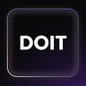

# Welcome to My Website

This is the home page content. You can write anything here using Markdown.

<iframe src="https://edwindoit.substack.com/embed" width="480" height="320" style="border:1px solid #EEE; background:white;" frameborder="0" scrolling="no"></iframe> 

<iframe src="https://edwindoit.substack.com/embed" width="480" height="150" style="border:1px solid #EEE; background:white;" frameborder="0" scrolling="no"></iframe>

## The 4 Acts book is nearing completion   🚀

      **[Check it out  →](https://edwindoit.com/4acts)**      

Get in touch to proofread the latest version

</aside>

## Edwin

## **I write about  fundamental explanations and how they lead us to the most suitable course of action**

**Currently, I am...** 

- Writing [The 4 Acts Book](https://www.notion.so/The-4-Acts-model-0f1d1e318fa343649b43edddef6fb33a?pvs=21) (first review cycle)
- Growing health-tech company [Formelio](https://www.notion.so/Edwindoit-com-homepage-6cab4304f04c464eab83a2e14ab70e08?pvs=21) (COO)
- Creating personal workflows & [Notion templates](https://edwindoit.gumroad.com/) for improved effectiveness

<aside>

)

 

### **The Do-It Newsletter →**

Every month, I share an actionable rundown of what I'm working on and the great resources I come across. It covers science, health, productivity, technology, human progress, and rationality.

[https://edwindoit.substack.com/embed](https://edwindoit.substack.com/embed)

</aside>

## What you’ll find here

[About](https://www.notion.so/About-f5a3bc0f76c443bb86dc8be581cf7ccc?pvs=21)  ...  A description of myself and what I'm working on

[The 4 Acts model](https://www.notion.so/The-4-Acts-model-0f1d1e318fa343649b43edddef6fb33a?pvs=21) …  A model to understand the first principles of how the world works to make optimal decisions  

[Notion templates for personal use](https://www.notion.so/Notion-templates-and-guides-personal-827299ae72f5492d979d706878d5874e?pvs=21) ...  Practical guides and notion templates based on the 4 acts model

[Notion for businesses](https://www.notion.so/Notion-for-teams-8eb747ed3cde40358f22672c5a0a65b2?pvs=21) … Templates, custom-builds, and consulting on Notion 

**Social Media**

[Twitter](https://twitter.com/edwindoit)  

[Reddit](https://www.reddit.com/user/Practics1)

**1:1**

[e-mail me](mailto:me@edwindoit.com)

**Blog**

[Medium](https://medium.com/@edwindoit)

## I aim to make the systems and laws that govern reality simple to understand. In other words, to give a straightforward description of how the world around us works.

## I do this because I believe **the fundamental explanations of reality** lead us to the most suitable course of action.

> *“If you can't explain it simply, you don't understand it well enough” - Albert Einstein.*
> 

To comprehend complex ideas, we need to understand the basics of logic. If someone can only describe something using intricate words, high-level abstractions, or highly specific comparisons, they likely don't understand what they're talking about. Hammering down the basics is the best way to build our knowledge.

I describe these basic building blocks of knowledge and apply them to construct techniques for optimal selection, execution, and learning. This includes strategies for: 

- Reasoning in the face of complex systems
- Setting killer goals
- Consuming information effectively
- Running and coordinating your teams & businesses
- Optimizing energy and attention levels
- Taking responsibility (only) for all that you can control

## What I’m currently working on

- 📑 [The 4 Acts Book](https://www.notion.so/The-4-Acts-model-0f1d1e318fa343649b43edddef6fb33a?pvs=21) → My definitive breakdown of how the world works and how to apply the knowledge gained from it
- ✉️ [The Do-It newsletter](https://edwindoit.substack.com) ****→ Every month I share what I'm working on and enjoying
- [📂  Notion templates](https://www.notion.so/Notion-templates-and-guides-personal-827299ae72f5492d979d706878d5874e?pvs=21) → Like Life Goals OS. A complete goal-management system.
- 📱 [Apps](https://www.notion.so/Inactive-The-5-acts-tools-fafc0812226744dcb29d22ca442524ef?pvs=21) → like: the Remynder Ritual Goalbot, which helps you set and accomplish goals

## This is the place for you if you also enjoy these topics:

- Reality, human nature, and science
- Leaving the world better than you found it
- Improving your effectiveness through self-awareness and specifying your intentions
- Social and Technological innovations with a focus on decentralization
- Human Progress through innovation
- Popperian epistemology

## And, probably the wrong place if you're a fan of:

- Merely optimizing how efficient or productive you are
- Talking about issues but not solving them
- Short-term zero-sum success over long-term win-win dynamics
- (Tech) doomsday prophecies following the precautionary principle
- Believing that unsolvable problems exist
- Unfalsifiable theories such as macroeconomics and postmodernism

## My background

I’m a techy with strong organizational and leadership skills:

- Active within and founder of [social impact initiatives](http://nederlandmaaktimpact.nl) since **2018**
- From design intern to product manager to COO at [Formelio](http://Formelio.nl). From start-up to scale-up to stay-up. **2018 - 2023 and running**
- [Notion](http://notion.so) evangelist since **2020**

## What I believe in

- Accelerating Human Progress
- Critical rationalism (Popperian & Deutschian Epistemology)
- Optimalism & Effectiveness
- Rational optimism

> **I seek to bridge the gap between complex theories and real-world applications by making dense information understandable, decision-making simple, and murky problems clear.**
>